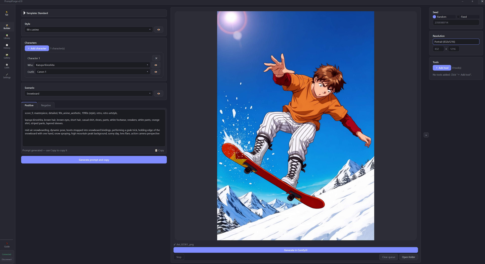
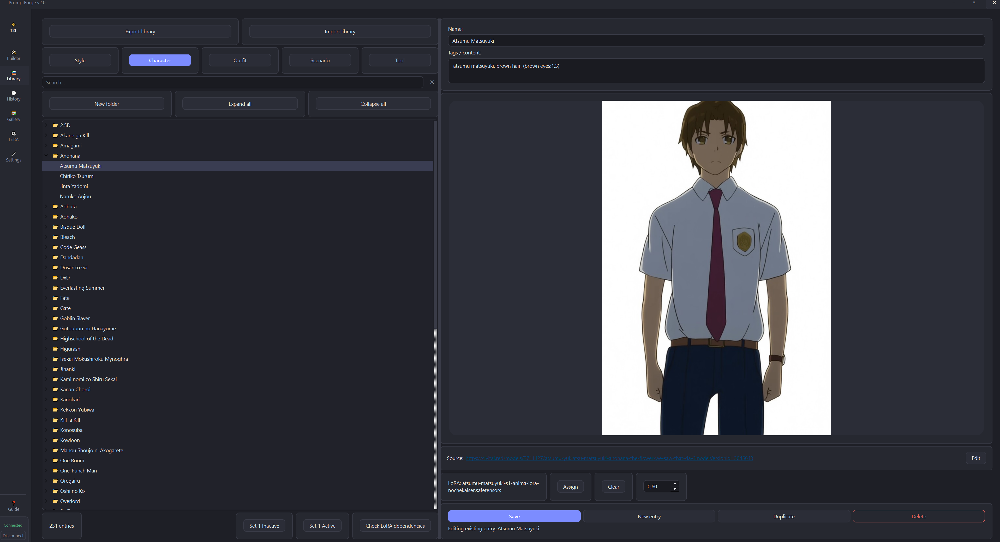

# ⚡ PromptForge 2

A desktop app for building AI image- and video-generation prompts out
of reusable building blocks — **styles**, **characters**, **outfits**,
**scenarios**, and **tools** — instead of retyping the same tags every
time, and for driving those prompts straight into a running
**ComfyUI** instance with a generation queue, live preview, LoRA
management, and a results gallery.

This is a full PyQt6 rewrite of the original PromptForge (Tkinter),
with a reworked sidebar-based UI, native window chrome, custom themes,
sound notifications, and a new Image Edit / Img2Video pipeline mode on
top of everything the original text-to-image builder could do.



## Features

### Builder
- **Standard builder** — pick a style, add any number of characters with their outfits, pick a scenario, and optionally add tools (anatomy fixers, detailers, or anything that's mostly a bound LoRA with little or no prompt text), then generate a ready-to-paste prompt with one click. Reorder the assembled blocks (style / characters / scenario / tools) however you like, and save your favorite orderings as reusable templates.
- **Custom templates** — write your own prompt skeleton with placeholders like `[Name 1]`, `[Description 1]`, `[Outfit 1]`, `[Style]`, `[Scenario]`, `[Tool]`, and fill them in from dropdowns each time you generate.
- **Tools** — a library category for entries that are mostly (or entirely) about a bound LoRA rather than prompt text — anatomy fixers, hand detailers, sharpness boosts, anything Stable Diffusion effectively needs a helper LoRA for. Unlike every other category, a Tool can be saved with completely empty tags. A Tool's tag can optionally be marked "force to the very start of the prompt", for tools that trigger specific behavior (e.g. `@fixedanatomy`) and need to land ahead of everything else regardless of how the rest of the prompt is ordered.
- **Image Edit (img2img) and Img2Video (img2vid) modes** — a third mode switch alongside the standard text-to-image builder. Load a starting image right inside PromptForge (drag-and-drop or a file picker — no need to Alt-Tab into the ComfyUI browser tab to use its own LoadImage widget) and PromptForge uploads and patches it into the active workflow automatically, the same way it already handles prompt text and LoRA selections. Each mode gets its own Library categories (**Image Actions** / **Video Actions**, plus mode-specific **Tools**) and its own Custom template variables, so i2i/i2v prompt building doesn't get mixed up with t2i entries. An embedded video player shows the finished clip for Img2Video generations without leaving the app.
- **Direct ComfyUI generation with a queue** — connect to a running ComfyUI instance (via the companion custom node) and send your assembled prompt straight to it with **🎨 Generate in ComfyUI**, no copy-pasting. Every click queues a generation (with its own frozen snapshot of LoRAs/strengths/seed) rather than refusing while something's already running — a separate **⏹ Stop** button cancels only the one currently in progress, and **🗑 Clear queue** drops everything still waiting (never the one already generating, matching ComfyUI's own queue UI). Watch live preview frames while it samples, and get the finished image or video back in the Builder tab and the Gallery. Prefer to just build the text? **⚡ Generate prompt and copy** still does that, with or without ComfyUI connected. See [Connecting to ComfyUI](#connecting-to-comfyui) below.
- **LoRA Manager** — attach LoRAs to a generation either manually or automatically (pulled from whichever library entries — characters, outfits, styles, tools — are bound to one), tagged `[M]`(manual lora)/`[A]`(automatic lora) so you always know which is which. Validated against ComfyUI's live LoRA list before every submit, so a missing file is caught up front instead of silently skipping. Collapsible, and your slots/strengths persist between sessions.

### Library
- **Library manager** — a built-in editor for your styles, scenarios, characters, outfits, and tools, with search, per-character "canon" outfits, an optional source URL per entry (for crediting/finding the original model or reference), and an optional bound LoRA (used by the LoRA Manager's auto slots, with an adjustable default strength right on the entry). While connected to ComfyUI, entries with a bound LoRA are color-coded right in the list — green if it's found, yellow if a same-named file was found elsewhere (worth double-checking), red if nothing matching exists at all.
- **Active / Inactive entries** — mark any entry, or any whole folder, inactive without deleting it. Inactive entries and folders are skipped entirely by the Builder's dropdowns (not just greyed out), so a large library can be trimmed down for a session without losing anything — the Library tab itself still shows everything, dimmed, for browsing.
- **Library subfolders** — organize entries within each category into folders (and nested subfolders) purely for browsing: drag an entry onto a folder, or right-click → **Move to…** for one-off or multi-select moves. Folders sort alphabetically above entries at every level (numbers sort numerically — "Outfit 2" before "Outfit 10" — not character-by-character), expand/collapse individually or all at once, and have zero effect on the Builder, search, or LoRA bindings — an entry's name stays the single thing that identifies it everywhere else. Canon outfits are filed automatically into an always-present **Canonical Outfits** folder so they don't clutter the regular outfit list. See [Library subfolders](#library-subfolders) below.
- **Reference images (and video previews)** — attach a preview image, or a preview video for Video Action/Video Tool entries, to any library entry by dragging a file onto the editor or clicking to browse. Images are auto-converted, resized, and saved next to their entry. The preview size is adjustable with a slider and remembered between sessions.
- **LoRA dependency checking** — a one-click scan of your whole library against ComfyUI's current LoRA list, so you can confirm everything a downloaded library expects is actually in place before generating dozens of characters, not after a confusing result on one of them. If something's missing, it can search for a same-named file elsewhere and offer it as a candidate — applied one at a time with your confirmation, or all at once if every candidate is an unambiguous single match. A genuine name collision (two different LoRAs sharing a filename, e.g. for different base models) is always shown as a real choice, never auto-picked.
- **Library export / import** — back up or share your whole library as a single zip (everything except the disposable ComfyUI preview cache). Importing merges new entries in by name and never overwrites, modifies, or even touches anything that already exists in your library, including Active/Inactive state and folder placement.

### History & Gallery
- **History** — every generated prompt is saved automatically, with favorites and one-click restore back into the builder. While connected to ComfyUI, a history entry also records which LoRAs (and at what strength) were active for that specific generation, plus a one-click "Open image" that resolves to the same result the Gallery shows.
- **Gallery** — every image or video generated through ComfyUI this session shows up as a thumbnail, with always-visible action buttons, hover-to-reveal-in-explorer, and click-to-open-full-size.

### Look & feel
- **Custom title bar and native window snapping** — a themed title bar that matches the rest of the app instead of the OS default, with real Windows Snap/Snap Layouts support (drag to an edge, or hover the maximize button) rather than losing that OS feature just for having a custom frame.
- **Light / Dark / Custom themes** — pick a base and an accent color and the rest of the palette (backgrounds, borders, text, hover states) is derived automatically, with an automatic contrast check so text never goes unreadable against an unlucky color choice. A custom theme can also carry a user-uploaded background image, with adjustable card opacity and background blur.
- **Sound notifications** — optional sounds for "generation ready", "image saved", and "entry added", each independently selectable (off / built-in / your own uploaded sound) and independently volume-controlled from the Settings page.
- **In-app guide** — press **F1** or click **❓ Guide** anywhere in the app for a built-in walkthrough: first-run order of operations, how subfolders/Tools/LoRA Manager/the queue/Active-Inactive actually work, and the ComfyUI "last active workflow tab" behavior below. Multi-language from the start (English, Russian, Mandarin Chinese and Japanese guide variations are available).
- All data is stored locally in plain `.txt` / `.json` / `.jpg` files — easy to back up, sync, or edit by hand.

## Screenshots

| Builder | Library |
|---|---|
|  |  |

## Getting started

### Requirements

- Python 3.9+ (Windows or Linux; see [Data & storage](#data--storage) for where files live on each)
- [`PyQt6`](https://pypi.org/project/PyQt6/) — the UI toolkit
- [`Pillow`](https://pypi.org/project/pillow/) — image conversion, resizing, and previews for library reference images and the Gallery
- A running [ComfyUI](https://github.com/comfyanonymous/ComfyUI) instance with the **PromptForge Connection** custom node package installed — only if you want direct ComfyUI generation. Everything else works fully without it.

### Run from source

```bash
pip install -r requirements.txt
python main.py
```

On first launch, a `prompt_forge_data/` folder is created right next to the program — see [Data & storage](#data--storage).

### Linux

Linux is a first-class supported platform: a `.desktop` file is included under `packaging/linux/`, and prebuilt Linux binaries are published on GitHub Releases alongside the Windows `.exe` (built inside an older pinned Ubuntu container for broad `glibc` compatibility, not directly on the latest runner image, so it runs on older-but-still-common distros too).

## Sample library

A small starter library ships in this repo — a handful of styles, characters, scenarios, and outfits, all plain text descriptions with **no LoRA bindings**, just so there's something to look at and generate from immediately instead of staring at an empty Library tab.

To use it: **Library tab → 📥 Import library** and pick the zip from this repo. Since it's a clean import into an empty library, everything in it will be added (see [Library export / import](#library-export--import) for what happens on a name clash, if you're merging it into a library you've already started building).

## Building a standalone .exe / Linux binary

The repo ships a `PromptForge.spec` (PyInstaller) and a GitHub Actions workflow (`.github/workflows/release.yml`) that builds both a Windows `.exe` and a Linux binary automatically whenever a version tag is pushed, and attaches both to the same GitHub Release. You don't need a Linux machine to produce the Linux build — GitHub's own runners do it.

To build locally instead:

```bash
pip install pyinstaller
pyinstaller PromptForge.spec
```

The result lands in `dist/`, with `icon.ico` (Windows) / `icon.png` (Linux) picked up automatically.

## Connecting to ComfyUI

Direct generation requires the companion [**PromptForge Connection**](https://github.com/SirZavod/PromptForge-Nodes/tree/main)
custom node package installed in `ComfyUI/custom_nodes/` (separate
install — see that package's own repository).

1. Place a **PromptForge Connector** node in your ComfyUI graph (and, optionally, a **PromptForge Multi Lora Loader** node for i2i/i2v graphs), wired up per the node package's README.
2. In PromptForge's Builder tab, open the **ComfyUI** panel and tick **"ComfyUI connected?"**.
3. Build your prompt as usual, then either:
   - **⚡ Generate prompt and copy** — assembles the prompt and copies it to the clipboard, same as always, ComfyUI untouched.
   - **🎨 Generate in ComfyUI** — patches your prompt/negative prompt/seed/resolution (and LoRA Manager selections, and the loaded input image for i2i/i2v, if any) into the live graph and submits it. The **"Latest ComfyUI image"** panel shows live preview frames while it samples, then the finished result — which also lands in the **Gallery** tab.

Live preview depends entirely on ComfyUI's own **Settings → Comfy →
Execution → Live preview method**. If it's set to `none`, no frames
arrive — that's ComfyUI's setting, not a PromptForge toggle.

> **Live preview stopped working after a ComfyUI update?** A few users
> have reported live preview silently breaking after updating to the
> latest ComfyUI, even with the setting above configured correctly. This
> isn't a PromptForge issue — it's been resolved for them by launching
> ComfyUI with an explicit preview method flag, e.g.
> `--preview-method latent2rgb` (or another supported method). Worth
> trying if preview frames stopped arriving right after an update.

### ⚠️ Generation always targets the *last active* workflow in the browser

PromptForge has no concept of "which workflow you meant" — it asks the
bridge for whatever graph was most recently active in the ComfyUI
browser tab, and submits to that. Concretely:

- If you have two workflows open — say **Anima** and **Klein**, each
  with a Connector node — and **Klein** was the last tab you clicked on
  (even just to glance at it, no editing required), your next
  **🎨 Generate in ComfyUI** goes to Klein. You can close that tab
  immediately afterward; the generation still runs.
- Click over to the Anima tab and back, and the next generation goes to
  Anima instead — LoRAs included.
- This holds even if you close the browser tab, close the browser
  entirely, or kill the browser process afterward — ComfyUI keeps using
  whichever workflow was last active. That also means you can free up
  the RAM a browser tab uses once you've confirmed the right workflow is
  active, without affecting generation at all.

**Rule of thumb:** whichever ComfyUI workflow tab was open last is where
the job is going.

## Library subfolders

Each category in the Library tab can be organized into folders and
nested subfolders — purely as a browsing aid. Folders are never part
of an entry's identity: an entry's name is still the one thing the
Builder, search, history, and LoRA bindings care about. You can rename
a folder, move its contents around, or delete it entirely without
touching a single `.txt`/`.jpg`/`.meta.json` file on disk.

- **Creating a folder** — right-click anywhere in the list (an entry, a
  folder, or empty space) → **New folder…**. Right-click a folder →
  **New subfolder here** to nest one inside it.
- **Moving entries in** — either drag an entry (or a multi-selection made
  with Shift/Ctrl) onto a folder, or right-click → **Move to…** and pick
  a destination, including back to the category root.
- **Expand / collapse** — click a folder's disclosure arrow to open or
  close it, or use the **▾ Expand all** / **▸ Collapse all** buttons
  above the list to do it for the whole category at once.
- **Sorting** — folders always sort above entries, alphabetically, at
  every level of nesting. Sorting is "natural" — embedded numbers compare
  numerically, so "Outfit 2" comes before "Outfit 10".
- **Search** — typing in the search box filters by entry name/content
  only; a folder's own name is never part of the match. Folders
  containing a match auto-expand for the duration of the search.
- **Canon outfits** — automatically filed into a dedicated **Canonical
  Outfits** folder the moment an outfit is marked as a character's canon
  outfit. That folder is system-managed: it can't be renamed or deleted.

## Active / Inactive entries

Every Library entry, and every folder, can be marked **Inactive**
without deleting it. Inactive entries — and everything inside an
inactive folder — are skipped entirely by the Builder's dropdowns, not
just shown greyed out. Useful for trimming a large library down to
what you actually want available this session without losing anything
permanently.

- Right-click an entry (single or multi-select) or a folder →
  **Mark Inactive** / **Mark Active**.
- Two bottom-bar buttons, relabeled to show a count whenever something's
  selected ("Set N Inactive" / "Set N Active"), otherwise apply to the
  whole current category.
- The Library tab itself still shows inactive entries (dimmed) for
  browsing — only the Builder's dropdowns actually exclude them.
- An entry is inactive if it's flagged itself, or if any parent folder
  is flagged — checked live, nothing is silently propagated onto the
  entry itself.

## Tools

Tools are library entries (their own category, alongside styles,
scenarios, characters, and outfits — with a separate set for Image
Edit and Img2Video mode) for things that are mostly — or entirely —
about a **bound LoRA** rather than prompt text: anatomy fixers, hand
detailers, sharpness boosts, anything Stable Diffusion effectively
can't do without a helper LoRA. Unlike every other category, a Tool
can be saved with **completely empty tags** — its only job might be
feeding the LoRA Manager's auto slots.

If a Tool *does* have a short tag (some workflows trigger specific
behavior with something like `@fixedanatomy`), check **"Force this
tool's tag to the very start of the prompt"** in the Library editor.
That tag then always lands as the very first thing in the assembled
prompt — ahead of Style/Characters/Scenario — no matter how you've
reordered everything else via **Block order…**.

Tools work in both the Standard builder (its own collapsible "▸ Tools"
section, collapsed by default) and Custom templates, via the `[Tool]`
variable.

## Generation queue

Clicking **🎨 Generate in ComfyUI** always succeeds immediately — it
adds your current prompt, seed, resolution, and LoRA snapshot to a
queue rather than refusing if something is already generating.
Everything about that click (including which LoRAs and strengths are
active right then) is frozen into that queue entry; changing a LoRA
strength afterward only affects *future* clicks, never one already
queued.

Exactly one job runs with ComfyUI at a time; queued items wait their
turn and start automatically as each one finishes. **⏹ Stop** cancels
only the one currently running, then the next queued item starts
automatically. **🗑 Clear queue** removes everything still *waiting*,
but never the one already generating — use Stop for that one
specifically. The small counter next to Generate ("📋 generating +
*N* queued") distinguishes "something's already running, *N* more
behind it" from "nothing running, *N* waiting to start".

## LoRA dependency checking & auto-link

**🔍 Check LoRA dependencies** (Library tab, requires a ComfyUI
connection) scans every entry in every category — including canon
outfits — for a bound LoRA, and reports anything ComfyUI's current LoRA
list doesn't actually have, grouped by which entry(ies) use it.

If something's missing, **🔎 Find candidates** searches ComfyUI's LoRA
list for files with the same *filename* under a different folder. A
single match can be applied with one click — or all single-match
candidates at once — but a **name collision** (two or more files
sharing a filename, e.g. for two different base models) is always
shown as a real choice, never auto-picked.

While connected to ComfyUI, this same check also drives small color
indicators directly in the Library list: green for an exact match,
yellow for "a candidate exists but isn't a confirmed match" (including
collisions), red for "nothing found at all". The colors disappear the
moment you leave the Library tab or disconnect ComfyUI.

## Library export / import

**📦 Export library** zips your whole `prompt_forge_data/` folder
(everything except the disposable ComfyUI preview cache) for backing
up or sharing. **📥 Import library** merges another exported zip into
your current library, category by category — strictly by name: if an
entry already exists, the incoming one is skipped and your existing
entry is left completely untouched. Active/Inactive state and folder
placement come along with the import. A report afterward lists exactly
what was imported and what was skipped.

## In-app guide

Press **F1**, or click **❓ Guide** in the top bar, anywhere in the app
for a built-in walkthrough — the actual order to do things in on first
launch, how subfolders/Tools/Active-Inactive/the LoRA Manager/the
generation queue work, and the ComfyUI "last active workflow tab"
behavior from above. English is fully written; other languages are
switchable from the same window and explicitly marked if a section is
still pending translation, rather than silently falling back to
English without saying so.

## Data & storage

`prompt_forge_data/` always appears **right next to the program itself**
— the `.py` file when run from source, or the executable when run
compiled — regardless of which folder you happened to launch it from:

```
prompt_forge_data/
├── styles/
│   ├── cityStyle.txt
│   ├── cityStyle.jpg           # optional reference image, same name as the entry
│   └── cityStyle.meta.json     # optional: source URL / bound LoRA / force-to-start flag for this entry
├── scenarios/
├── characters/
├── outfits/
├── tools/
├── image_actions/              # Image Edit (img2img) mode library entries
├── video_actions/               # Img2Video mode library entries
├── edit_tools/                  # Tools for Image Edit mode
├── video_tools/                 # Tools for Img2Video mode
├── sounds/
│   ├── gen_ready/                # your uploaded custom sounds, per action
│   ├── image_saved/
│   └── entry_added/
├── theme/                        # custom theme background image, if set
├── _templates.json               # saved block-order templates
├── _custom_templates.json        # custom text templates
├── _history.json                 # generated-prompt history (LoRA usage + image/video link, if ComfyUI was connected)
├── _settings.json                # theme, sounds, image-preview size, and other UI preferences
├── _folders.json                 # per-category library subfolder placement (UI only)
├── _active.json                  # per-category Active/Inactive state for entries and folders
└── _comfy_previews/              # session-only cache of images/videos pulled from ComfyUI
                                   # wiped on every app restart, never holds your only copy
```

Each library entry's image/video and metadata (if any) sit right next
to its `.txt` file under the same base name, so renaming, duplicating,
or deleting an entry in the app keeps them in sync automatically.

The `prompt_forge_data/` folder (everything *except* `_comfy_previews/`,
which is just a disposable cache) is fully portable — copy it to
another machine, or back it up, to bring your whole library, history,
and reference images with you.

## License

This project is released into the public domain under [The Unlicense](https://unlicense.org/).

```
This is free and unencumbered software released into the public domain.

Anyone is free to copy, modify, publish, use, compile, sell, or distribute
this software, either in source code form or as a compiled binary, for any
purpose, commercial or non-commercial, and by any means.

In jurisdictions that recognize copyright laws, the author or authors of
this software dedicate any and all copyright interest in the software to
the public domain. We make this dedication for the benefit of the public
at large and to the detriment of our heirs and successors. We intend this
dedication to be an overt act of relinquishment in perpetuity of all
present and future rights to this software under copyright law.

THE SOFTWARE IS PROVIDED "AS IS", WITHOUT WARRANTY OF ANY KIND, EXPRESS OR
IMPLIED, INCLUDING BUT NOT LIMITED TO THE WARRANTIES OF MERCHANTABILITY,
FITNESS FOR A PARTICULAR PURPOSE AND NONINFRINGEMENT. IN NO EVENT SHALL THE
AUTHORS BE LIABLE FOR ANY CLAIM, DAMAGES OR OTHER LIABILITY, WHETHER IN AN
ACTION OF CONTRACT, TORT OR OTHERWISE, ARISING FROM, OUT OF OR IN
CONNECTION WITH THE SOFTWARE OR THE USE OR OTHER DEALINGS IN THE SOFTWARE.

For more information, please refer to <https://unlicense.org/>
```
